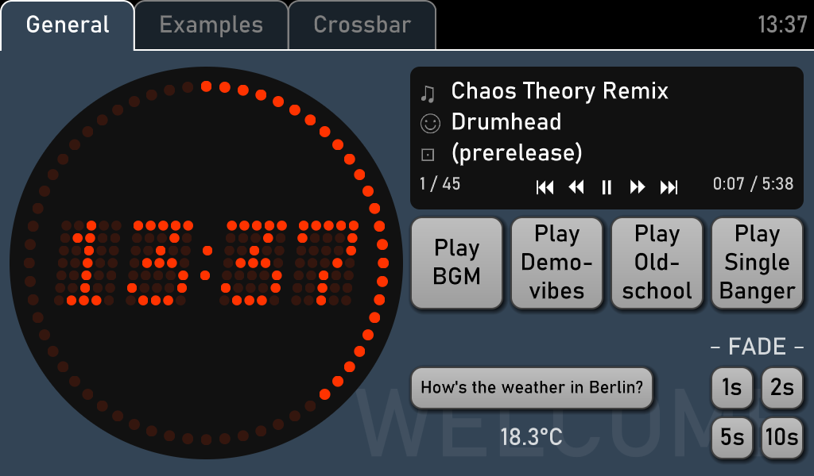
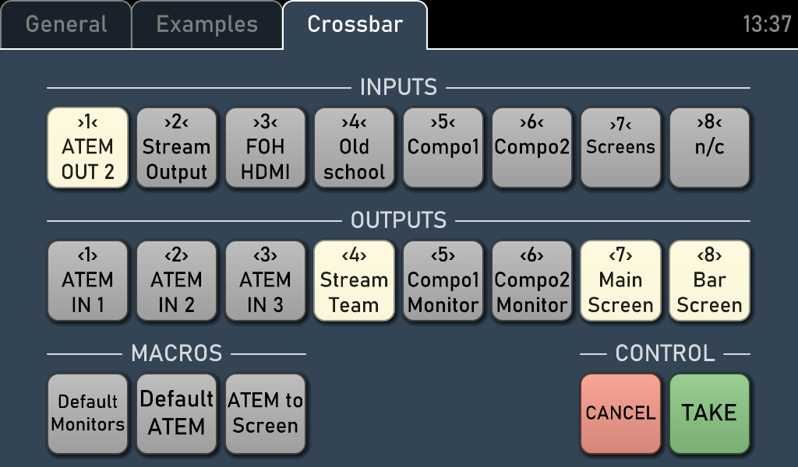

# Touchscreen Control Panel

A multi-purpose control panel application framework for use with touchscreens.

[](doc/screenshot1.png)
[](doc/screenshot2.png)

## Features

- arbitrary grid of buttons across multiple tabs
- fullscreen and "hide mouse cursor" mode for touchscreen kiosks
- special functionality:
  - big "studio clock" display
  - control of an [MPD](https://www.musicpd.org) (Music Player Daemon) instance, e.g. to manage background music at venues
  - control of DVI/HDMI matrix switchers ("crossbars") from [Extron](https://www.extron.com/product/dxphdmi), [LightWare](https://lightware.com/products/matrices-switchers) and [Gefen](https://gefen.com/switchers/)
  - simple API to send arbitrary HTTP requests with JSON payload, e.g. to interface with REST APIs
- written in Python 3.x
- UI layout described in relatively simple Python code
- UI rendering based on OpenGL 2.1 or later
- minimal runtime dependencies:
  - requires the [SDL2](https://libsdl.org) library at runtime
  - requires the PIL/[Pillow](https://python-pillow.org) Python package
  - no other Python packages needed; everything (including the OpenGL and SDL interfaces) is built-in
- ships with a Bash script for running starting or re-starting the control panel, even from SSH sessions
- free software ([MIT-licensed](LICENSE.txt))

The primary use case, and the reason why this software exists, is managing background music and video switching at events with a complex audio/video setup (specifically, [demoparties](https://en.wikipedia.org/wiki/Demoscene#Parties)) with a simple touchscreen attached to a Raspberry Pi.

## Installation

The control panel applications (like `ctrlpad_test.py`) can just be run like any other Python script if the following prerequisites are fulfilled:
- [Windows] a [Python](https://www.python.org/downloads/) installation
  (Linux distributions generally ship with Python these days, so an extra installation is usually not needed there)
- [Windows] a copy of `SDL2.dll` in the same directory as the application; get the [latest Windows package](https://github.com/libsdl-org/SDL/releases) with the architecture that fits your Python installation and extract the file from there
- an installation of [Pillow](https://python-pillow.org)
  - e.g. with PIP: `python3 -m pip install pillow`
  - [Linux] or as a distribution package
    - e.g. on Debian, Ubuntu and derivates: `sudo apt install python3-pil`
- [Linux] an installation of the SDL2 library via the distribution's package manager
  - e.g. on Debian, Ubuntu and derivates, run `sudo apt install libsdl2-2.0-0`

(The Linux instructions may also work on other Unix-like systems like *BSD.)

## Using `run.sh`

On Unix systems, the wrapper script `run.sh` can be used to launch the application in a convenient way. This gives the following additional features and benefits:
- will always start the "correct" script
- automatically restarts the control panel if it already runs (e.g. after the configuration has been changed)
- can ensure that MPD is started too
- runs the actual control panel application in the background, like a daemon
- output is redirected into a central log file, `run.log`
- `run.sh` can be run from an SSH session that doesn't need to persist

To do so, create a copy of [`run.conf.example`](run.conf.example) named `run.conf` and adjust the settings in that file as desired. Then, run `run.sh` to start the control panel. Re-running `run.sh` quits a potentially running instance of the control panel application and re-starts it. This can be useful e.g. when the script has been changed to add or modify the controls on the panel.

Note that for running the control panel in the background (e.g. from an SSH session) using the `X11_DISPLAY` option in `run.conf`, the device must obviously run an X server. Compatibility with Xwayland or even KMS consoles hasn't been tested.

## Creating a custom control panel

To create a custom control panel, create a new Python script whose `__main__` function calls `ctrlpad.run_application()` with a custom initialization function that populates the UI. A minimal "hello world" example looks like this:

```python
import ctrlpad

def init_app(env):
    pass  # TODO: add controls here

if __name__ == "__main__":
    ctrlpad.run_application("Hello World", init_app)
```

This application doesn't do anything but show a black screen with a clock in the upper-right corner; to make it useful, the `init_app()` function should contain code to create UI elements. For example, let's start with a tab page that contains space for a grid of other controls, at least 16x8 of them:

```python
    from ctrlpad.controls import GridLayout
    page = env.toplevel.add_page(GridLayout(16,8), "Hello", label="WELCOME")
```

This is still pretty empty, so let's add a first button:

```python
    from ctrlpad.controls import Button
    btn = page.pack(2,2, Button("Click me!"))
```

The button occupies 2x2 grid cells (that's the `2,2` arguments in `pack()`); this is a good default size for buttons, as it still allows smaller buttons and labels to be added inbetween.

Anyway, the button might be there, but it doesn't do very much yet. The `@bind` decorator can be used to call a function when the button is clicked (our touched):

```python
    from ctrlpad.controls import bind
    @bind(btn)
    def cmd(env, btn):
        print("You clicked me, thank you very much!")
```

The name of the function must be `cmd`, as that's the name of the event the function shall be attached to. It's called with two arguments: a `ControlEnvironment` instance that gives access to the current time, the window, the OpenGL renderer etc.; and a reference to the button that was pressed to create the event.

This should be enough for a very short first tutorial; to learn more, please have a look into [`ctrlpad_test.py`](ctrlpad_test.py). This is an example script that demonstrates most features of the framework.
